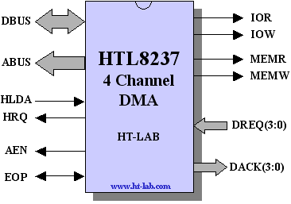
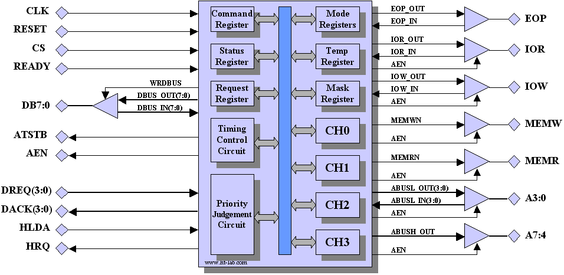

# HTL8237 an 8237 Compatible DMA IP core

<p align="center">
  
</p>


## 1. Introduction

The **HTL8237** is a synchronous implementation of the industry standard 8237A Direct Memory Access Controller. The DMA controller is fully pin and software compatible with the 8237A and support four independently programmable channels. Each channel is capable of performing memory-to-memory, memory-to/from-peripheral and memory initialisation tasks. The DMA controller is written in vendor neutral VHDL and can be used for ASIC/FPGA implementations.

The **HTL8237** supports four DMA channels each with an address range of 64K bytes/words. An address can be auto incremented, decremented or put on hold to support initialisation tasks. A channel can be programmed to automatically re-initialise after each transfer. The DMA controller support 4 modes of operations, single, block, demand and cascade.

Single mode allows one transfer before returning the bus to the processor; this mode ensures that the processor can always access the bus between DMA transfers.

Block mode transfers a programmed number of words without returning the bus. During the transfer the bus request signal is kept asserted until all words have been transferred or the End-Of-Process(EOP) signal is asserted.

In demand mode the peripheral continues to transfer data until exhausted or when the preprogrammed number of transfers has been reached or when EOP signal is asserted.

The final mode is the cascade mode which is used to extend the number of channels by cascading additional 8237 controller(s).


<p align="center">

Figure 1: Internal structure of the HTL8237
</p>


## 2. Directory Structure

| **Directory**       | **Contents**                                            |
|---------------------|---------------------------------------------------------|
| HTL8237\doc         | Documentation and Datasheets                            |
| HTL8237\rtl         | Synthesizable VHDL Core files                           |
| HTL8237\testbench   | Testbench VHDL files                                    |
| HTL8237\Simulation  | Example script for Modelsim                             |
| HTL8237\Synthesis   | Synthesis file list                                     |

## 3. Filelist

The HTL8237 synthesizable design is contained in 6 VHDL files, the dependency order is listed in the file fileList.txt. The following files are listed in the RTL directory.

| **Filename**        | **Contains**                                               |
|---------------------|------------------------------------------------------------|
| HTL8237_pkg.vhd     | Definitions                                                |
| dreqack_rtl.vhd     | DMA Request and Acknowledge logic                          |
| fsm37_fsm.vhd       | Finite State machine controlling the various blocks        |
| channel_rtl.vhd     | Logic/counters for each DMA channel (4 times instantiated) |
| blk37_struct.vhd    | Embedded Top Level, no tri-states                          |
| HTL8237_struct.vhd  | Top Level                                                  |


The basic testbench for the HTL8237 consist of 5 files:

| **Filename**         | **Contains**                                               |
|----------------------|------------------------------------------------------------|
| sram_behavior        | sram memory model <sup>**Note1**</sup>                                |
| utils.vhd            | Various utility routines                                   |
| ioblk_behavioral     | I/O device simulation model                                |
| stimulus_behavioral  | Stimulus generator                                         |
| HTL8237_tb_struct.vhd| HTL8237 top level Testbench                                |


**Note1** : Free download from [http://tams-www.informatik.uni-hamburg.de/vhdl/models/sram/sram.html](http://tams-www.informatik.uni-hamburg.de/vhdl/models/sram/sram.html)

## 4. Simulation

The HTL8237 is written in synthesizable VHDL and as such can be simulated by most if not all simulation tools.

An example simulation script is provided for *Siemens'* Modelsim or Questa. To run the simulation navigate to the simulation directory and execute the **run.bat** file from within a DOSbox/CMD shell. Alternative, execute the **run.do** file from within the Modelsim GUI.

The output in both cases should be similar to the text shown below (only part of the output shown).

```
#  ======================= Init Master 8239 ==================================== 
#  ======================= Single Transfer Read Test =========================== 
#  ----------- HTL8237 status before memory to IO transfer -------------------- 
#  CH0:A=0000 C=0000  CH1:A=0000 C=0000  CH2:A=0000 C=0004  CH3:A=0000 C=0000
#  MD0:D,A++,  ,VF    MD1:D,A++,  ,VF    MD2:S,A++,  ,RD    MD3:D,A++,  ,VF   
#  Status=00 Mask=B Request=0 Command=00 Temp=00
#  Start DMA Test 0 Addr++, 5 bytes, address 10000-10004
#  DACK2 Asserted
#    IO DMA Write channel 2 H
#    CPU has access to the bus
#  DACK2 Asserted
#    IO DMA Write channel 2 e
#    CPU has access to the bus
#  DACK2 Asserted
#    IO DMA Write channel 2 l
#    CPU has access to the bus
#  DACK2 Asserted
#    IO DMA Write channel 2 l
#    CPU has access to the bus
#  DACK2 Asserted
#    IO DMA Write channel 2 o
#  EOP Asserted Channel 2
#    CPU has access to the bus
#  ----------- 82C37 status after memory to IO transfer ---------------------- 
#  CH0:A=0000 C=0000  CH1:A=0000 C=0000  CH2:A=0005 C=FFFF  CH3:A=0000 C=0000
#  MD0:D,A++,  ,VF    MD1:D,A++,  ,VF    MD2:S,A++,  ,RD    MD3:D,A++,  ,VF   
#  Status=04 Mask=F Request=0 Command=00 Temp=00
# 
#  ----------- HTL8237 status before memory to IO transfer -------------------- 
#  CH0:A=0000 C=0000  CH1:A=0000 C=0000  CH2:A=0000 C=0004  CH3:A=0000 C=0000
#  MD0:D,A++,  ,VF    MD1:D,A++,  ,VF    MD2:S,A++,AI,RD    MD3:D,A++,  ,VF   
#  Status=00 Mask=B Request=0 Command=00 Temp=00
#  Start DMA Test 1 Addr++, 5 bytes, address 10000-10004, AutoInit
```
The expected output is shown in the file **expected_output.txt** located in the *simulation* directory.

### 4.1 HTL8237

The HTL8237 core consist of 3 main blocks, the channel block (instance ICH0,1,2,3) contains the address and count registers, DREQ/DACK logic (instance DRQA) and a finite state machine (instance FSM). Surrounding the blocks are a few registers and multiplexers. The operation of the HTL8237 is best described with the FSM as the starting point as this blocks control all the various signals.

A DMA cycle starts when dma_req is asserted, the FSM jumps from Sidle to S1. If memory_to_memory mode is selected (signal mem_2_mem='1') the FSM will continue to jump to state S11 and performs 2 back to back memory cycles, for all other modes (Block/Single/Demand) the FSM jumps to state S1 and continues until S4. Bit 6 and 7 of the mode register can be found in signal dma_mode[1:0].

After each completed single transfer the FSM will assert the endbuscycle signal during state S4 (Block/Single/Demand) and state S24 (memory to memory). The endbuscycle signal is used to update the various address and count registers in the channel blocks. The endbuscycle is multiplexed onto a 4 bits vector (endbuscycle_s) depending on the current active channel (dma_chan). For a memory to memory transfer the endbuscycle signal controls both channel0 and channel1.

At the end of the block transfer when the channel word counter rolls over from 0000 to 0xFFFF the corresponding terminal count signal (tc0,1,2,3) is asserted. This signal is used to assert the EOP_out signal. The tc0,1,2,3 signals are also used to reset the various counters to their initial value if the autoinitialization bit is set in the channel's mode register. When the external EOP signal is asserted (active low) the FSM will sample the signal during S2/S4 for Block/Single/Demand transfers and S22/S24 for memory_to_memory transfers. Only during state S4 and S24 is the external EOP acted upon (FSM output signal eop_latched_cld). When both eop_latched_cld and endbuscycle are asserted the request register (request_reg_s located in the instance DRQA) is cleared.

Each channel instance has a borrowcarry signal which is asserted when the address register rolls over from 0 to 0xFF and from 0xFF to 0 (depending on the mode register Address increment/decrement select). This is then used in the FSM to jump from state S4/S24 to state S1/S11 which results in an ADSTB pulse.

If the mode register is programmed for Cascade mode (dma_mode="11") then the FSM jumps from the idle state Sidle to state S0 when a dma request is detected (dma_req='1'). The FSM then continues to state Scas when the CPU relinquishes the bus (HLDA is asserted) and stays in this state until HLDA is negated or the dma request is removed. During the Scas state no read/write signals or address strobe is generated, the controller will only act as a priority decoder for the various channels.

Further description of the various registers and modes can be found in the 82C37 datasheet.

### 4.2 Testbench

The testbench (*testbench\HTL8237_tb_struct.vhd*) instantiates two HTL8237 (Master/Slave), an I/O device simulation model (IO0), a stimulus generator (STIM) and two 128Kbyte SRAM memory models (MEM0/MEM1). The stimulus generator will generate a number of DMA requests scenarios and will output the HTL8237 status before and after each transfer.
```
----------- HTL8237 status before Memory to Memory transfer -----------------
# CH0:A=0007 C=0004 CH1:A=001E C=0004 CH2:A=000B C=FFFF CH3:A=000A C=0004
# MD0:B,A--,AI,RD MD1:B,A--,AI,WR MD2:B,A++, ,RD MD3:S,A++, ,RD
# Status=00 Mask=E Request=0 Command=01 Temp=6C MEM2MEM
```
CHx:A=0007 C=0004    DMA Channel Address and Counter value

MDx:\<type\>,\<addr\>,\<init\>,\<rw\> DMA Channel Mode

| **Description**        | **Meaning**                                             |
|---------------------|------------------------------------------------------------|
| \<type\>            | **D**=Demand mode, **B**=Block mode, **S**=Single Mode, **C**=Cascade Mode |			          
| \<addr\>            | **A--**=Address Decrement, **A++**=Address Increment               |			          
| \<init\>            | **AI**=Autoinitialization Enable, blank=disabled               | 			          
| \<rw\>              | **RD**=Memory Read IO Write, **WR**=Memory Write IO Read, **VF**=Verify|
| Status              |  **Status** Register                                           |
| Mask                |  **Mask** Register                                             |
| Request             |  **Request** Register                                          |
| Command             |  **Command** Register                                          |
| Temp                |  Memory to Memory **Temp**orary Register                       |


The last section decodes the Command Register, possible values are MEM2MEM, CH0Hold, Compressed Timing, Rotate Priority, Extended Write.

Some helper procedures are available to simulate an *x86* IN (inport) and OUT (outport) port instruction. Example:

```
inport(REQUEST\_REGISTER\_C,data\_s);
outport(BASE\_COUNT2\_C,X"04");
```
The Stimulus generator (instance STIM) works in combination with the IO device simulation model (Instance IO0). The testmode signal indicates which test is in progress. Each test is further subdivided into smaller test (minor changes) and is indicated by the loop variable "n".

```
--=========================================================================
-- TestX
--
-- Test Action
-- 0 Addr++, 5 bytes, address 10000-10004
-- 1 Addr++, 5 bytes, address 10000-10004, AutoInit
-- 2 Addr--, 5 bytes, address 10004-10000, Extended write
--=========================================================================
for n in 0 to 2 loop
    various tests
end loop;
```

For some of the test the waveform is shown to highlight some timing issues. The waveforms are from Mentor Graphics Modelsim.

The full test sequence with comments can be found the *doc\htl8237.pdf* file


## 5. Synthesis

The HTL8237 can be synthesized using any modern synthesis tool. An in order file list is provided in the synthesis directory.

## 6. Pin Description

| **Symbol** |  **Type** | **Function** |
|------------|-------|--------------------------------------------------|
| CLK        |   I   | Clock Input Signal, note logic is clocked on the **falling** edge |
| RESET      |   I   | Asynchronous reset input <sup>**Note1**</sup>                            |
| CS         |   I   | Active low chip select input                                  |
| DREQ       |   I   | Synchronous DMA request input <sup>**Note2**</sup>                       |
| READY      |   I   | Active high READY signal to extend R/W times <sup>**Note2,3**</sup>      |
| HRQ        |   O   | Active high Hold Request output                               |
| HLDA       |   I   | Active high Hold Acknowledge input                            |
| DACK       |   O   | DMA Acknowledge output                                        |
| DB         |   I/O | Bidirectional Data Bus                                        |
| IOR        |   I/O | Active low IO Read                                            |
| IOW        |   I/O | Active low IO Write                                           |
| EOP        |   I/O | Active low End of Process <sup>**Note2,3**</sup>                         |
| ABUSL      |   I/O | Address bits A[3-0]                                           |
| ABUSH      |   O   | Address bits A[7-4]                                           |
| AEN        |   O   | Address Enable output                                         |
| ADSTB      |   O   | Address Strobe output                                         |
| MEMR       |   O   | Active low Memory Read output                                 |
| MEMW       |   O   | Active low Memory Write output                                |
| NC         |   O   | Pin5 on the original VLSI 8237 is a no connect (tri-stated)   |

**Note1** : For some FPGA types, like Xilinx, a synchronous reset is more efficient.

**Note2** : Metastability prevention circuit (2/3 serial FF's) might be required.

**Note3** : Connect to VCC when not used.


### 6.1 RESET Signal

RESET is an active high asynchronous reset signal. No reset synchronization circuit (asynchronously asserted, synchronously negated) is available but can easily be added to the blk37 reset input. Note that all internal registers are asynchronously reset, for some FPGA vendors like Xilinx a synchronous reset is more efficient.

### 6.2 READY Signal

READY is a synchronous input signal used to extend the read/write strobes. The READY signal is only sampled at specific times during a DMA transfer. The signal should be tied to Vcc if not used.

The READY signal is "sampled" by the FSM during the transition from S3 to S4, S13 to S14 and from S23 to S24. If the signal is asynchronous then a metastability input protection circuit must be added. In addition, the FSM must be modified to take into account the additional delay input.

### 6.3 EOP Signal

EOP is an active low bidirectional End Of Process signal. The HTL8237 will pulse the output low when the terminal count of any of the channels has occurred. External circuitry can pull this signal low to terminate the DMA cycle. The EOP signal is asserted in the last clock cycle of the DMA transfer. The EOP is asserted low whilst the read/write cycle is in progress (as per the original VLSI device). As an input signal the EOP is sampled and latched during FSM states S2, S12, S22 and acted upon during states S4 and S24. Note that EOP is assumed to be a synchronous input signal.

## 7. Differences

The following lists the main differences between the HTL8237 and the original VLSI Intel 82C37A

1. The HTL8237 is not timing compatible with the original VLSI device.
2. The HTL8237 tries to be bus cycle compatible with the original VLSI device; however, small differences might occur [tbc].
3. Unlike the original VLSI device the HTL8237 clock cannot be stopped. The original VLSI device can be reconfigured with the clock stopped.

## 8. History

| **Version** | **Date** | **Changes**                                     |
|------------|------------|---------------------------------------------------|
|    1.0     | 20/01/2005 | First Version                                     |
|    1.1     | 07/04/2007 | EOP latching extended to S11/S12/S13, S21/S22/S23 |
|    1.2     | 08/03/2016 | First/Last FF logic changed to avoid glitches     |
|    1.3     | 20/11/2023 | Cleaned up and uploaded to github                 |

## 9. License

See the LICENSE file for details.

## Trademarks

ModelSim®, Questa, QuestaSim and their respective logos are trademarks or registered trademarks of Siemens Industry Software Limited. All other trademarks are the property of their respective owners.

